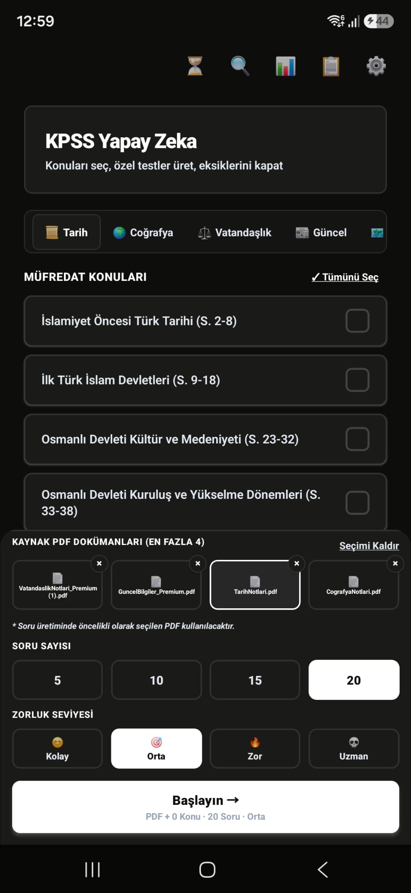
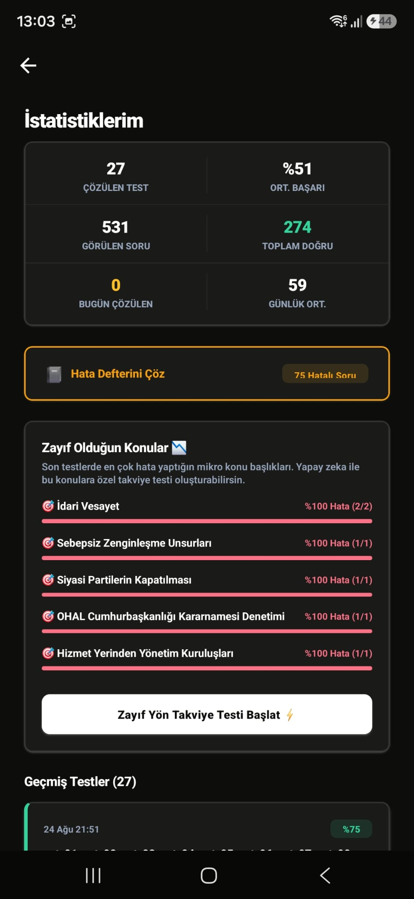
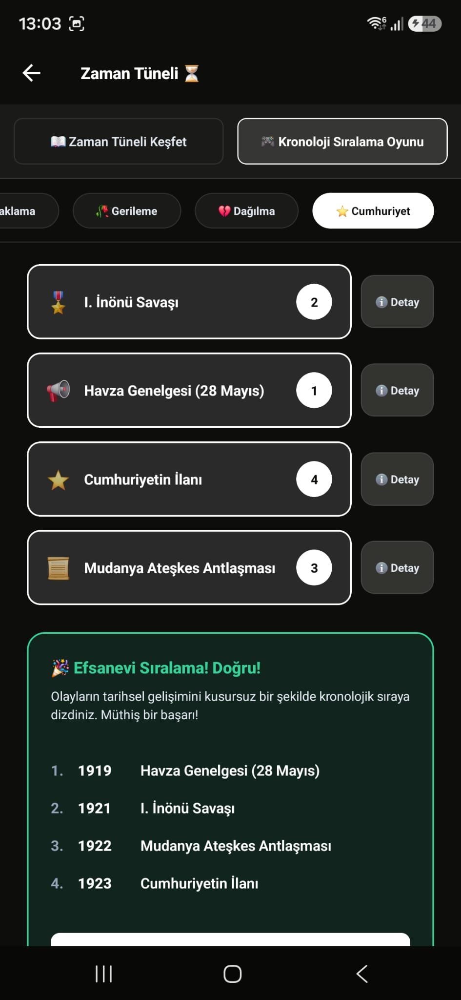

# QuestionBank — AI Destekli Coğrafya & Sınav Simülatörü

QuestionBank, adayların KPSS ve kurum içi yeterlilik sınavlarına hazırlanırken mekânsal analiz ve konu hakimiyetini ölçmek üzere tasarlanmış; Google Gemini LLM ile dinamik analiz ve soru üreten, interaktif SVG harita motoruna sahip hibrit bir mobil uygulamadır.

---

## 📱 Uygulama İçi Görseller

| AI Destekli Sınav Üretimi | Analitik & Zayıf Yön Analizi | İnteraktif Zaman Tüneli (Gamification) |
| :---: | :---: | :---: |
|  |  |  |

---

## 📌 Öne Çıkan Özellikler

* **Etkileşimli Vektörel Harita Motoru (SVG):** Türkiye ve Dünya haritaları üzerinde il/bölge bazlı koordinat ve sınır eşlemeleriyle mekânsal soru çözümü (TurkeyMapSvg, WorldMapSvg).
* **Gemini LLM Entegrasyonu:** Konu bazlı soru üretimi ve soru çözüm mantıklarının yapay zeka aracılığıyla anlık analiz edilmesi (geminiService).
* **Akıllı Hata Çözücü (Mistake Resolver):** Kullanıcının yanlış yaptığı soruları izleyen, zayıf olduğu konuları tespit eden ve odaklanmış tekrar testleri oluşturan döngü.
* **Optimize Durum Yönetimi:** Modüler Zustand store yapıları (useQuizStore, useMapQuizStore, useHistoryStore) ile minimum render maliyeti.
* **Metrik & Performans Takibi:** Detaylı sınav geçmişi, doğru/yanlış oranları ve soru bazlı süre analizleri.

---

## 🏛 Mimari & Teknik Kararlar

* **Neden Zustand?** Redux'ın getirdiği boilerplate kod kalabalığından kaçınmak, mobil cihazlarda context re-render maliyetini minimize etmek ve kalıcı depolama (persist storage) ile sınav geçmişini hafif bir yapıda tutmak için tercih edildi.
* **Neden react-native-svg?** Statik harita resimleri yerine 81 ilin path verilerini dinamik olarak boyamak, tıklanan ili algılamak ve anlık geri bildirim vermek için vektörel SVG mimarisi kurgulandı.
* **LLM Entegrasyon Stratejisi:** Gemini API yanıtları katı JSON şemasıyla sınırlandırılarak mobil arayüzün bekleme süreleri ve tip güvenliği garanti altına alındı.

---

## 🏗 Dizin Yapısı

* **src/components/**: Yeniden kullanılabilir UI bileşenleri ve harita SVG çizim katmanları
* **src/data/**: İl koordinatları, sınır path verileri ve statik coğrafi harita setleri
* **src/navigation/**: React Navigation yığın (Native Stack) yapılandırması
* **src/screens/**: Quiz, Harita Modu, Hata Çözücü ve Sonuç analiz ekranları
* **src/services/**: Gemini API entegrasyonu ve harita motoru iş kuralları
* **src/store/**: Zustand tabanlı global state yönetim havuzları
* **src/types/**: TypeScript tip, enum ve arayüz tanımları

---

## 🛠 Kullanılan Teknolojiler

* **Mobil Çatı:** React Native, Expo Application Services (EAS)
* **Dil:** TypeScript
* **Vektör & Harita:** react-native-svg
* **Yapay Zeka:** @google/generative-ai SDK
* **State Management:** Zustand
* **Navigasyon:** React Navigation (Native Stack)

---

## 🚀 Kurulum ve Çalıştırma

1. Depoyu klonlayın:  
`git clone https://github.com/FurkanCelik16/QuestionBank.git`

2. Bağımlılıkları yükleyin:  
`cd QuestionBank && npm install`

3. Kök dizinde .env dosyası oluşturup Gemini API anahtarınızı tanımlayın:  
`EXPO_PUBLIC_GEMINI_API_KEY=your_gemini_api_key_here`

4. Uygulamayı başlatın:  
`npx expo start`

---

## 📦 Build ve Dağıtım (EAS)

Android paketini derlemek için:  
`eas build -p android --profile preview`

---

## 📄 Lisans

Bu proje MIT lisansı ile korunmaktadır.
